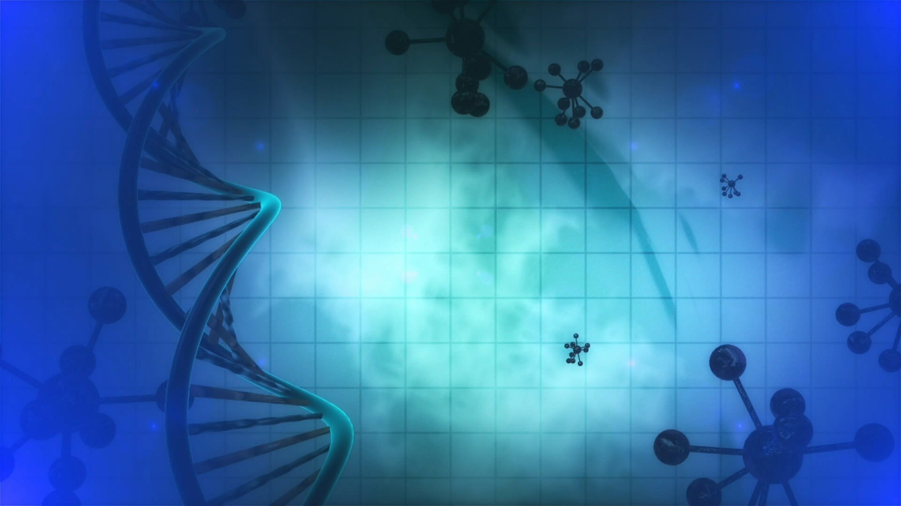

```{r setup, include=FALSE}
knitr::opts_chunk$set(echo = FALSE)
```



## I. Source

Source of the article: https://www.sciencedaily.com/releases/2019/11/191120131336.htm

Word count: 426

[PDF](https://github.com/RemyHrz/Remy-Harazin-blog/blob/master/pdf/article%204%20highlighted.pdf)

## II. Vocabulary

| Words from the text | Synonym/explanation in English | French translation |
| ------------------- | ------------------------------ | ------------------ |
| Strain              | variant of smth                | souche             |
| Prolong             | extend                         | prolonger          |

## III. Analysis table

|                              |                                                                                                                                                                                          |
| ---------------------------- | ---------------------------------------------------------------------------------------------------------------------------------------------------------------------------------------- |
| Researchers                  | University of Tsukuba  (Haruna Tani, Takayuki Mito, Vidya Velagapudi, Kaori Ishikawa, Moe Umehara, Kazuto Nakada, Anu Suomalainen & Jun-Ichi Hayashi)                                    |
| Published in ?               | Scientific Reports (05 November 2019)                                                                                                                                                    |
| General topic?               | Disruption of a gene shows a decrease in metabolic pathways and cellular growth                                                                                                          |
| Procedure/what was examined? | The gene SHMT2 (serine hydroxymethyltransferase 2), genetically modified mouse embryo with an impaired version of SHMT 2, proteins separation by SDS-polyacrylamide gel electrophoresis  |
| Conclusions/discovery?       | The gene SHMT2 is needed for proper function of the mitochondria and division of the cell                                                                                                |
| Remaining questions?         | How does epigenetic processes impact aging ?                                                                                                                                             |
